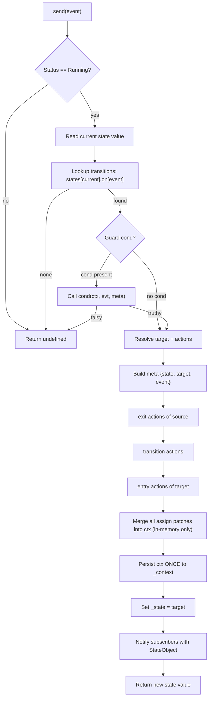
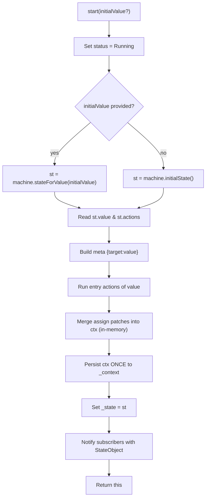
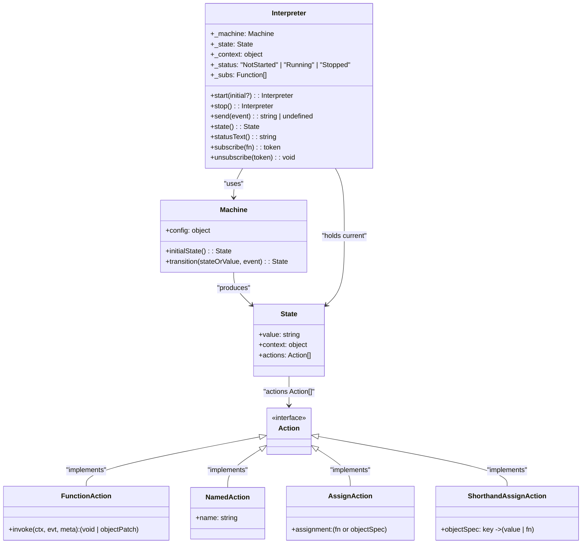

# Espruino Native FSM API (Phase 1)

This document describes the API of the native Espruino FSM engine implemented in C (`xfsm.c/.h` + `jswrap_xfsm.c/.h`), exposed to JavaScript through Espruino’s class system. The API design follows the conventions of **XState-FSM** while being optimized for **embedded microcontrollers**.

---

## Overview

- **Two core classes** are exposed:  
  - **`Machine`**: Represents a finite state machine configuration.  
  - **`Interpreter`**: Represents a running instance (service) of a machine.  

- **Actions**: Support for user-defined functions and built-in actions (e.g. `assign`).  
- **Context**: Mutable key/value object tied to the machine. Updated via `assign` actions.  
- **Events**: Trigger transitions using `interpreter.send(event)`.

---

## Machine Class

**Constructor**

```javascript
var m = new Machine(config);
```

**Parameters**:

- config (object) – machine definition:
- id (string) – unique identifier.
- initial (string) – initial state key.
- context (object) – initial context (optional).
- states (object) – state definitions.
- actions (object) – named reusable actions (optional).

**Returns**: a Machine object.

Notes:

- The configuration is stored as a JsVar tree (not copied).
- Validation occurs during construction.

## Interpreter Class

**Creation**:
```javascript
var service = m.interpret();
```

**Returns**: an Interpreter object bound to the Machine.

## Methods / Properties

`start()`

```javascript
service.start();
```

- Starts the interpreter.
- Enters the initial state and executes entry actions.
- Returns the Interpreter instance (chainable).

##
 `stop()`

```javascript
service.stop();
```

- Stops the interpreter.
- Clears listeners and halts event processing.

**Returns** the Interpreter.

## 
`send(event)`

```javascript
service.send("EVENT_NAME");
```

- Sends an event to the machine.
- Evaluates transitions from the current state.
- Executes:
  - exit actions for the current state.
  - Transition actions.
  - entry actions for the new state.
  - assign actions update the context.

**Returns** the new state object.

## 
`state`

```javascript
service.state
```

- Current state object:
  - `value` (string) – current state name.
  - `context` (object) – current context snapshot.

##
`subscribe(listener)`

```javascript
service.subscribe(function (state) {
  console.log(state.value, state.context);
});
```

- Registers a callback for state changes.
- Listener is invoked after every successful transition.

**Returns** an unsubscribe function (planned for later phase).


## Actions

1. User-Defined Actions
- Functions provided in entry, exit, or on.transition.actions.
- Invoked with (context, event, meta).

2. Built-In Actions

- `assign`: the only built-in action implemented in Phase 1.

```javascript
entry: [
  { type: "xstate.assign", assignment: { count: (ctx) => ctx.count + 1 } }
]
```

- Updates context immutably.
- Evaluated before other actions in the same list.
- Implements the same rules as XState (pure function, no side effects).

Future Phases: log and other standard built-ins.

## Example

```javascript
var m = new Machine({
  id: "counter",
  initial: "idle",
  context: { count: 0 },
  states: {
    idle: {
      on: {
        INC: {
          target: "idle",
          actions: [
            { type: "xstate.assign", assignment: { count: (ctx) => ctx.count + 1 } }
          ]
        }
      }
    }
  }
});

var service = m.interpret();

service.subscribe((state) => {
  console.log("Now in state", state.value, "with count", state.context.count);
});

service.start();
service.send("INC"); // count = 1
service.send("INC"); // count = 2
```

## Implementation Notes

- Naming alignment: Machine and Interpreter follow XState-FSM naming directly; no aliases.
- Minimal wrapper layers: Context updates and action resolution occur in the interpreter core, not through extra indirection.
- Pure functions: Built-in actions like assign are pure and do not perform side effects directly.
- Memory safety: Care taken to lock/unlock JsVar objects correctly.
- Burn-in testing: Example REPL scripts verify correctness across repeated .start(), .send(), and .stop() calls.

## Flow Summary

### 1) Runtime flow: Interpreter.send(event)


 ## Notes

- Guard truthiness uses Espruino’s boolean coercion (jsvGetBool).
- Actions order is exit → transition → entry.
- Context is updated in memory during the loop; it is persisted once after all actions finish (avoids lock/unlock hazards).
- Assign handling:
- { type: "xstate.assign", assignment: fn|object }, or shorthand object.
- Produces a patch that is shallow-merged into context.

---

### 2) Startup flow: Interpreter.start([initialValue])



---



  Note for AssignAction:

  "Explicit built‑in: type=\"xstate.assign\" (alias: \"assign\").
  - If assignment is a function: call (ctx, evt, meta) -> patch (object)
  - If assignment is an object: evaluate function values, use raw values as‑is
  - Shallow‑merge resulting patch into context after action group"

  Note for ShorthandAssignAction:
  
  "Shorthand built‑in: plain object used in action list.
  - Equivalent to assign with objectSpec
  - Shallow‑merged into context after action group"

