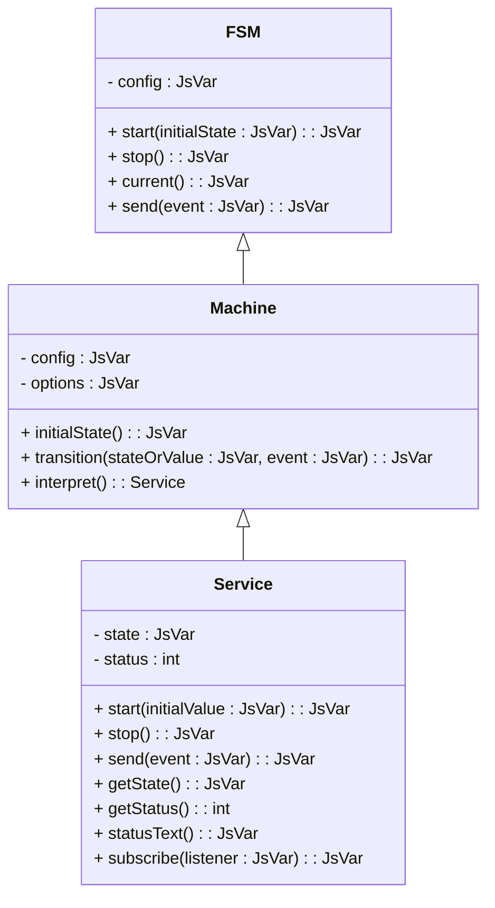

# jswrap_xfsm Documentation

This document provides an overview of the classes defined in `jswrap_xfsm.c`.

## Description

### FSM
The `FSM` class is included for backward compatibility, where states are stored on the instance.

#### Methods:
- `start(initialState: JsVar): JsVar` - Starts the FSM with an optional initial state.
- `stop(): JsVar` - Stops the FSM.
- `current(): JsVar` - Retrieves the current state.
- `send(event: JsVar): JsVar` - Sends an event to the FSM.

### Machine
The `Machine` class is a pure implementation that creates state objects and services.

#### Methods:
- `initialState(): JsVar` - Fetches the initial state of the machine.
- `transition(stateOrValue: JsVar, event: JsVar): JsVar` - Transitions the machine to the next state based on the event.
- `interpret(): Service` - Creates a `Service` interpreter for the machine.

### Service
The `Service` class is an interpreter that runs actions/guards and maintains its own context.

#### Methods:
- `start(initialValue: JsVar): JsVar` - Starts the service with an optional initial state.
- `stop(): JsVar` - Stops the service.
- `send(event: JsVar): JsVar` - Sends an event to the service.
- `getState(): JsVar` - Retrieves the current state of the service.
- `getStatus(): int` - Fetches the service's status (0=NotStarted, 1=Running, 2=Stopped).
- `statusText(): JsVar` - Retrieves the status as a string.
- `subscribe(listener: JsVar): JsVar` - Subscribes a listener function.