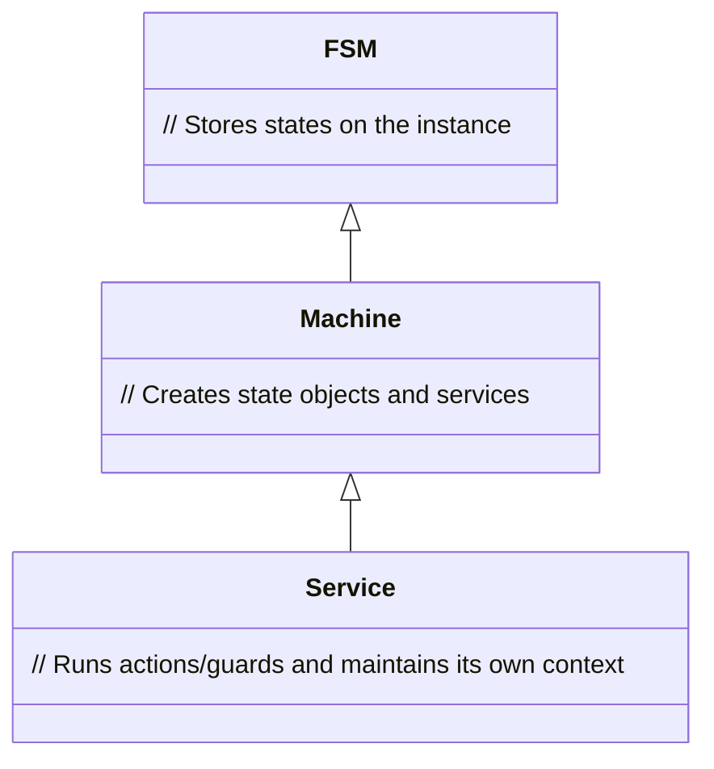

# jswrap_xfsm Documentation

This document provides an overview of the classes defined in `jswrap_xfsm.c`.

## Description

### FSM
The `FSM` class is included for backward compatibility, where states are stored on the instance.

### Machine
The `Machine` class is a pure implementation that creates state objects and services.

### Service
The `Service` class is an interpreter that runs actions/guards and maintains its own context.